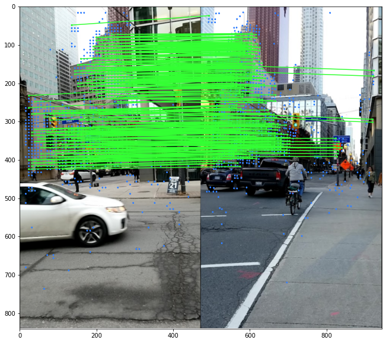
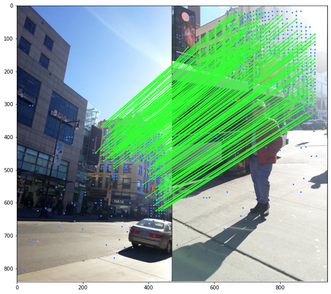
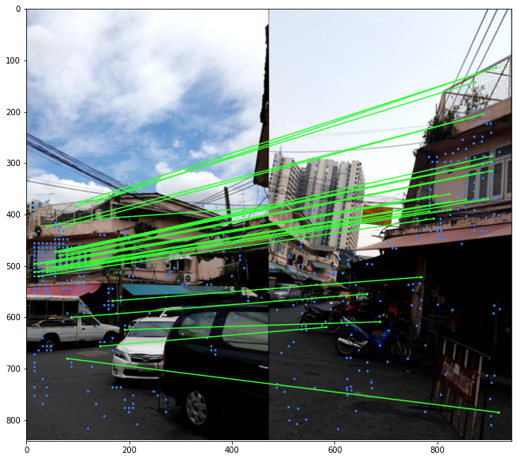

# Estimación de Pose de Cámara usando Transformadores de Características Locales

El proceso para reconstruir objetos y edificios en 3D a partir de imágenes se llama Reconstrucción a partir de Movimiento (SfM, por sus siglas en inglés). Típicamente, estas imágenes son capturadas por operadores expertos bajo condiciones controladas, asegurando datos homogéneos y de alta calidad. Es mucho más difícil construir modelos 3D a partir de imágenes variadas, dada la amplia variedad de puntos de vista, condiciones de iluminación y clima, oclusiones causadas por personas y vehículos, e incluso filtros aplicados por los usuarios. 

La primera parte del problema consiste en identificar qué partes de dos imágenes capturan los mismos puntos físicos de una escena, como las esquinas de una ventana. Esto se logra típicamente mediante características locales. El emparejamiento de características se refiere a encontrar características correspondientes entre dos imágenes similares basándose en un algoritmo de distancia de búsqueda. Una de las imágenes se considera la fuente y la otra el destino, y la técnica de emparejamiento de características se utiliza para encontrar o derivar y transferir atributos de la imagen fuente a la de destino. 

El proceso de emparejamiento de características analiza generalmente la topología de las imágenes de origen y destino, detecta los patrones de características, empareja los patrones y empareja las características dentro de los patrones descubiertos. La precisión del emparejamiento de características depende de la similitud, complejidad y calidad de las imágenes. Por lo general, se puede lograr un alto porcentaje de emparejamientos exitosos utilizando el método correcto, mientras que la incertidumbre y los errores pueden ocurrir y requerir una inspección posterior y correcciones. 

El objetivo de este proyecto es encontrar puntos coincidentes entre dos imágenes (vistas) de una misma escena y obtener la matriz fundamental, y por tanto, la pose relativa entre las dos imágenes. Es un proceso importante porque es el primer paso para la Reconstrucción 3D, Localización y Mapeo Simultáneos (SLAM) y Costura Panorámica.

## Uso

Pasos para crear el entorno
```bash
# create a conda environment. Python version 3.9 is necessary.
conda create -n loftr python=3.9

# install relevant libraries
conda install pytorch torchvision kornia einops pandas matplotlib opencv loguru -c pytorch
pip install pytorch_lightning kornia_moons
```
## Estructura de Archivos
Por favor, asegúrate de **seguir esta estructura de archivos específica** mencionada aquí. El conjunto de datos y otros archivos relevantes se pueden encontrar [aquí](https://drive.google.com/drive/folders/1-zAaqigu1OWFG6PhUg51aIcKRk9gkByh?usp=sharing).

```
.
├── depth-masks-imc2022
│  └── depth_maps
├── evaluation-notebook.ipynb
├── image-matching-challenge-2022
│  ├── sample_submission.csv
│  ├── test.csv
│  ├── test_images
│  └── train
├── imc-gt
│  └── train.csv
├── kornia-loftr
│  ├── kornia-0.6.4-py2.py3-none-any.whl
│  ├── kornia_moons-0.1.9-py3-none-any.whl
│  ├── loftr_outdoor.ckpt
│  ├── outdoor_ds.ckpt
│  └── outdoor_ot.ckpt
├── loftrutils
│  ├── einops-0.4.1-py3-none-any.whl
│  ├── LoFTR-master
│  └── outdoor_ds.ckpt
├── README.md
├── train.py
├── training-notebook.ipynb
└── weights
   └── model_weights.ckpt
```
## Conjunto de Datos

<div align=center>

</div>
<br>

El conjunto de entrenamiento contiene miles de imágenes de 16 ubicaciones, todas las cuales son atracciones turísticas populares. Esto incluye lugares como el Palacio de Buckingham, el Memorial Lincoln, la Catedral de Notre Dame, el Taj Mahal y el Panteón. Además de las imágenes, proporcionan dos archivos CSV. El archivo de calibración contiene las matrices de calibración de la cámara que son necesarias para construir matrices fundamentales. El archivo de covisibilidad de pares contiene la métrica de covisibilidad entre pares de imágenes y las matrices fundamentales de verdad terrenal para cada par. El conjunto de prueba contiene 3 pares de imágenes para los cuales los participantes deben generar matrices fundamentales para demostrar los envíos. 

## LoFTR

LoFTR (Local Feature TRansformer) es un modelo que realiza emparejamiento de características de imágenes sin detector. En lugar de realizar métodos de procesamiento de imágenes como la detección, descripción y emparejamiento de características de manera secuencial, primero establece un emparejamiento denso a nivel de píxel y luego refina los emparejamientos. 

En contraste con los métodos tradicionales que utilizan un volumen de costo para buscar coincidencias correspondientes, el marco de trabajo utiliza capas de autoatención y atención cruzada de su modelo Transformer para obtener descriptores de características presentes en ambas imágenes. El campo receptivo global proporcionado por el Transformer permite a LoFTR producir emparejamientos densos incluso en áreas de baja textura, donde los detectores de características tradicionales suelen tener dificultades para producir puntos de interés repetibles. 

Además, el modelo del marco de trabajo viene preentrenado en conjuntos de datos interiores y exteriores para detectar el tipo de imagen que se está analizando, con características como la autoatención. Por lo tanto, hace que LoFTR supere ampliamente a otros métodos del estado del arte. 

<div align=center>

</div>
<br>

LoFTR tiene los siguientes pasos: 

* La CNN extrae los mapas de características de nivel grueso, Característica A y Característica B, junto con los mapas de características de nivel fino creados a partir del par de imágenes A y B. 
* Luego, los mapas de características creados se aplanan en vectores 1-D y se añaden con la codificación posicional que describe la orientación posicional de los objetos presentes en la imagen de entrada. Las características añadidas son luego procesadas por el módulo Transformador de Características Locales (LoFTR). 
* Posteriormente, se utiliza una capa de emparejamiento diferenciable para emparejar las características transformadas, la cual proporciona una matriz de confianza. Los emparejamientos se seleccionan según el nivel de umbral de confianza y los criterios de vecino más cercano mutuo, obteniendo una predicción de emparejamiento de nivel grueso.  
* Para cada predicción gruesa seleccionada, se recorta una ventana local de tamaño w × w del mapa de características de nivel fino. Los emparejamientos gruesos se refinan luego desde esta ventana local a un nivel subpíxel y se consideran como la predicción de emparejamiento final.

## Métrica de Evaluación

Para el Desafío de Emparejamiento de Imágenes, CVPR'22, se pidió a todos los participantes que estimaran la pose relativa de una imagen con respecto a otra. Los envíos se evaluaron mediante la Precisión Promedio Media (mAA) de las poses estimadas. 

Dada una matriz fundamental y el valor real oculto, se calcula el error en términos de rotación (en grados) y traslación (en metros). Dado un umbral para cada uno, una pose se clasifica como precisa si cumple con ambos umbrales. Esto se realiza sobre diez pares de umbrales, un par a la vez.

Se calcula el porcentaje de pares de imágenes que cumplen con cada par de umbrales, y se promedian los resultados sobre todos los umbrales, lo cual premia las poses más precisas. Dado que el conjunto de datos contiene múltiples escenas, que tienen un número diferente de pares, calculamos esta métrica por separado para cada escena y la promediamos posteriormente.

# Resultados

El valor de mAA para nuestro modelo es 0.725 en todas las escenas del conjunto de datos.

<div align=center>



</div>

# Observaciones y Conclusiones
* Los Transformadores pueden proporcionar una estimación mucho mejor de la pose entre dos cámaras, en comparación con los métodos tradicionales.
* Debido al aspecto de la codificación posicional, los Transformadores son una muy buena forma de distinguir características similares localmente de características similares globalmente entre dos imágenes de una escena con gran línea base.
* Esto permite un emparejamiento de imágenes más robusto para múltiples tareas de visión por computadora como la Reconstrucción 3D, SLAM, SfM y Costura Panorámica.
